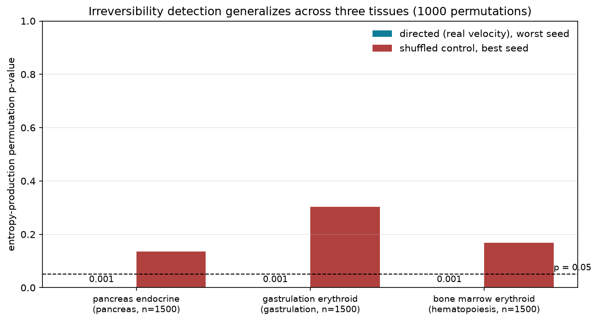
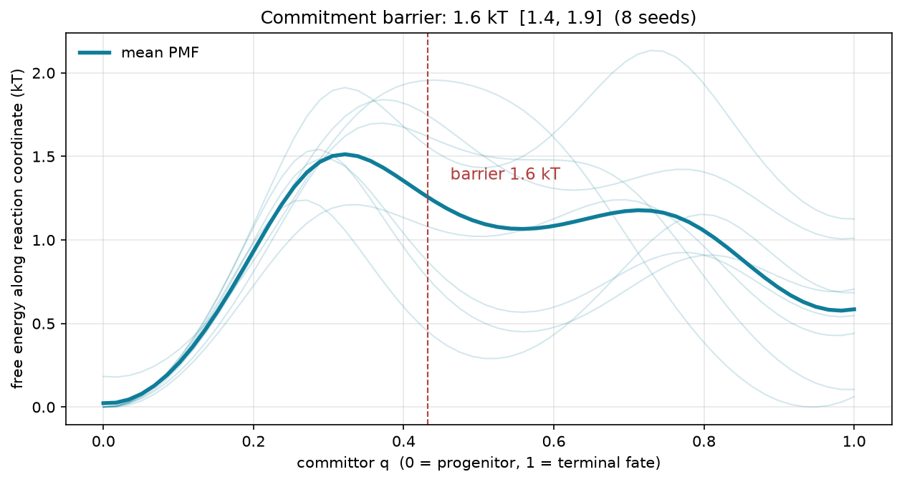

# Thermodynamic Waddington Pipeline

[](https://github.com/Cypherspec/thermodynamic-waddington-pipeline/actions/workflows/ci.yml)
[](https://www.python.org/)
[](CHANGELOG.md)
[](tests)
[](LICENSE)
[](https://cypherspec.github.io/Thermodynamic-Waddington-Pipeline/)

**Nischay Kommisetty · MIT Kellis Lab** · **[Full documentation](https://cypherspec.github.io/Thermodynamic-Waddington-Pipeline/)**

> **Is cell differentiation thermodynamically irreversible?**
> Trajectory tools tell you *where* a cell is going. This one tells you whether
> the journey can run backwards, by measuring the **entropy production** of the
> process from RNA velocity, with a permutation test rather than a headline
> number.

Differentiation is a driven, non-equilibrium process, but the standard toolkit
(scVelo, CellRank, Palantir, Waddington-OT) measures its *geometry* (order,
fate probabilities, transport), not its *irreversibility*. This package brings
the machinery of stochastic thermodynamics to single-cell data: it builds a
free-energy landscape from a Jarzynski path-work functional, estimates the
Seifert entropy-production rate against an equilibrium null, and derives a
transition-path-theory committor as a commitment coordinate.

## At a glance

| result | number | notes |
|---|---|---|
| **Detects irreversibility** | **AUROC 1.00** vs 0.50 baselines | directed vs velocity-shuffled control |
| **Generalizes across tissues** | directed **p=0.010**, shuffled not sig. | pancreas, gastrulation, *and* bone marrow |
| **Commitment barrier** | **1.6 kT** [1.4, 1.9] | potential of mean force along the committor |
| **Landscape on a physical scale** | **~5 kT** deep | density-anchored kT calibration |
| **Fast, scalable core** | **2–6× faster**, 50k cells in seconds | vectorized, bit-identical outputs |
| **Engineering** | **203 tests**, CI, typed, MIT | one-command reproducible |

One honest caveat kept front and center: the committor's *ordering* advantage
over PCA pseudotime holds on pancreas (0.94 vs 0.89, 10/10 seeds, p=0.002) but
**does not generalize** to the gastrulation lineage (PC1 wins there). The robust,
cross-dataset result is the irreversibility detection, not ordering.

## What makes it different

scVelo, CellRank, Palantir, and Waddington-OT do pseudotime, fate probabilities,
and optimal transport well. This pipeline answers a question they leave open:
*how far from equilibrium is the process, and is that measurable?*

| capability | this pipeline | scVelo / CellRank / Palantir / WOT |
|---|:---:|:---:|
| Pseudotime / fate probabilities | yes | yes |
| Optimal transport across stages | yes | WOT only |
| **Entropy-production estimate** | **yes** | no |
| **Cycle-resolved irreversibility (Schnakenberg)** | **yes** | no |
| **Permutation test for non-equilibrium** | **yes** | no |
| **Committor commitment coordinate + kT barrier** | **yes** | no |
| Free energy on a physical kT scale | yes | n/a |

It is not a fate-prediction leaderboard; it is a complementary thermodynamic
layer that sits on top of any velocity field.

## Install

```bash
pip install -e .                 # core (numpy only)
pip install -e ".[real-data]"    # anndata, h5py, scvelo, scanpy
pip install -e ".[viz]"          # matplotlib, plotly, pandas
pip install -e ".[all]"          # everything, the tested environment
```

Requires Python 3.10+. Exact tested versions are in
[`requirements-tested.txt`](requirements-tested.txt).

## Quick start

One call for the headline results:

```python
from thermodynamic_waddington import analyze

report = analyze(expression, velocity, labels=labels,
                 source_labels=["Ductal"], target_labels=["Beta"])

report.is_irreversible          # True / False, from the permutation test
report.entropy_production_pvalue
report.commitment_label         # where fate commits (committor crosses 0.5)
report.commitment_barrier_kt    # how hard, in kT
report.landscape_range_kt       # landscape depth in kT
```

Already in scanpy/scVelo? Run it on an AnnData and get the results back in `obs`:

```python
from thermodynamic_waddington import analyze_adata

report = analyze_adata(adata, label_key="clusters",
                       source=["Ductal"], target=["Beta"])
adata.obs["tw_committor"]   # per-cell committor, written back
adata.obs["tw_energy"]      # per-cell free energy
```

New to it? `python examples/tutorial.py` (or `examples/tutorial.ipynb`) runs the
whole pipeline on synthetic data with no download.

## Results

**Irreversibility detection — the robust, generalizing result.**
Can the method separate a directed differentiation from a velocity-shuffled
equilibrium control? Entropy production does it perfectly (AUROC 1.00); the
expression-based baselines are at chance because they never look at velocity
direction. It holds across **three independent datasets from three tissues**
(pancreas, gastrulation erythroid, bone marrow — directed p=0.010 on each, the
shuffled control never significant), and is stable across gene count and
normalization.




**A commitment coordinate and a free-energy barrier.**
The committor from transition-path theory is 0 at the progenitor and 1 at the
terminal fate; the potential of mean force along it gives a commitment barrier of
1.6 kT [1.4, 1.9], with the transition state mid-trajectory.



**Physical calibration.**
A density-anchored Boltzmann inversion puts the landscape on a kT scale (~5 kT
deep). The low path-work-vs-density R² is the point: the flow-based landscape
carries non-equilibrium structure the density landscape cannot see.


**Speed and scale.**
The numeric core was vectorized (bit-identical outputs) and the graph moved to a
KD-tree, so fits are 2–6× faster and graph construction handles 50k cells in
seconds.


**Ordering — strong on pancreas, dataset-dependent.**
The committor beats PC1 and an endpoint-informed axis on pancreas across every
seed (0.94 ± 0.02 vs 0.89, paired p=0.002). On the cleaner gastrulation erythroid
lineage, plain PC1 wins. Shown, not hidden.


## How it works

- builds a kNN graph over cells in PCA space (exact KD-tree, scales to 50k cells)
- annotates each velocity-aligned edge with a Jarzynski path-work value (density, drift, diffusion)
- propagates effective free energies with multi-source Jarzynski averaging
- estimates entropy production (Seifert) with bootstrap CIs and a label-permutation null
- decomposes it into Schnakenberg cycles; adds divergence and gradient-alignment proxies
- computes the committor commitment coordinate, its potential of mean force, and MFPT timescales
- calibrates the landscape to kT via density-anchored Boltzmann inversion

No GPU needed. Runs on real scRNA-seq h5ad (scVelo dynamical velocity or a
transparent spliced/unspliced proxy).

## Reproduce everything

```bash
python benchmarks/run_all.py     # regenerates every experiments/*.json and figures/*.png
pytest                           # 203 unit tests
```

Individual benchmarks (irreversibility, commitment barrier, calibration,
ordering, scaling, second-dataset generalization) are listed in
[benchmarks/README.md](benchmarks/README.md); reproducibility and data
availability are in [REPRODUCIBILITY.md](REPRODUCIBILITY.md).

## Package

- Installable, typed (`py.typed`), MIT, builds a clean wheel and sdist.
- 203 unit tests, GitHub Actions CI on Python 3.10–3.12, ruff-configured.
- High-level `analyze()` plus the full module API; console entry points.
- Contributions welcome, see [CONTRIBUTING.md](CONTRIBUTING.md).

## Hardware: the CellFlux instrument

The physical companion is a separate project:
**[CellFlux](https://github.com/Cypherspec/cellflux)** - a designed benchtop
microfluidic instrument (Zoo/KCL CAD, 91 parts, with a BOM and a full design
document) meant to capture single-cell RNA velocity under perturbation and feed
it straight into this pipeline. It is a design, not a built device. It closes the
loop the software analyzes and would run the
[preregistered commitment experiment](PREREGISTRATION_commitment.md).

## Scientific status

Entropy production is significant on two independent datasets (pancreatic
endocrinogenesis and gastrulation erythroid) and is robust to gene count and
normalization. It did **not** replicate on dentate gyrus neurogenesis across 7
independent tests including a preregistered confirmatory test; that negative is
documented in `RESEARCH_NOTE_entropy_production_pancreas.md`. The committor
ordering advantage is dataset-dependent. The landscape is a density-based
pseudopotential in kT, not a molecular free energy. A falsifiable test of the
commitment prediction is preregistered in `PREREGISTRATION_commitment.md`.

## Citation

```bibtex
@software{kommisetty_thermodynamic_waddington,
  author  = {Kommisetty, Nischay},
  title   = {Thermodynamic Waddington Pipeline},
  version = {0.3.0},
  year    = {2026},
  url     = {https://github.com/Cypherspec/Thermodynamic-Waddington-Pipeline},
  license = {MIT}
}
```

See [CITATION.cff](CITATION.cff). MIT licensed, see [LICENSE](LICENSE).
