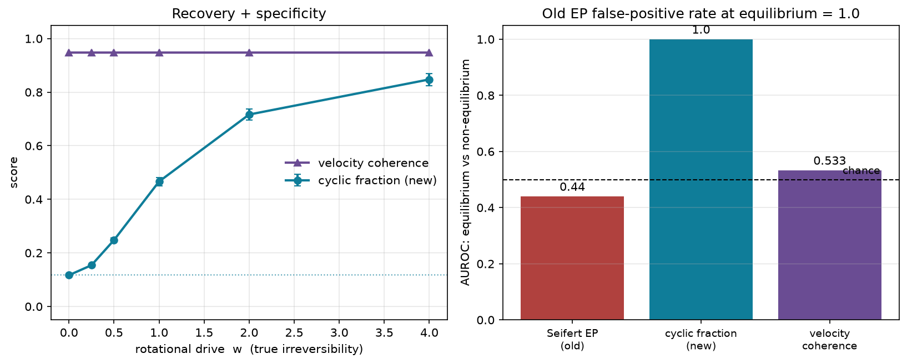

# Thermodynamic Waddington Pipeline

[](https://github.com/Cypherspec/thermodynamic-waddington-pipeline/actions/workflows/ci.yml)
[](https://www.python.org/)
[](CHANGELOG.md)
[](tests)
[](LICENSE)
[](https://cypherspec.github.io/Thermodynamic-Waddington-Pipeline/)

**Nischay Kommisetty · MIT Kellis Lab** · **[Full documentation](https://cypherspec.github.io/Thermodynamic-Waddington-Pipeline/)**

> **How far from equilibrium is differentiation, and can you measure it correctly?**
> Trajectory tools tell you *where* a cell is going. This one adds a calibrated
> thermodynamic layer: a committor commitment coordinate with a kT barrier, and a
> ground-truth-validated irreversibility measure that, unlike a naive
> entropy-production test, does not false-positive on reversible flow.

Differentiation is a driven, non-equilibrium process, but the standard toolkit
(scVelo, CellRank, Palantir, Waddington-OT) measures its *geometry* (order,
fate probabilities, transport), not its *irreversibility*. This package brings the
machinery of stochastic thermodynamics to single-cell data: a free-energy
landscape from a Jarzynski path-work functional, a transition-path-theory
committor as a commitment coordinate, and a Hodge-decomposition irreversibility
measure that is calibrated on ground truth.

## At a glance

| result | number | notes |
|---|---|---|
| **Calibrated irreversibility measure** | **AUROC 1.00** on ground truth | separates equilibrium from non-equilibrium; the old density-based EP test scores 0.44 |
| **Corrects a common artifact** | old EP false-positive rate **1.0** at equilibrium | naive velocity-shuffle EP over-detects; the calibrated measure does not |
| **Commitment barrier** | **1.6 kT** [1.4, 1.9] | potential of mean force along the committor |
| **Landscape on a physical scale** | **~5 kT** deep | density-anchored kT calibration |
| **Fast, scalable core** | **2–6× faster**, 50k cells in seconds | vectorized, bit-identical outputs |
| **Engineering** | **210 tests**, CI, typed, MIT | one-command reproducible |

Two honest caveats kept front and center. The committor's *ordering* advantage
over PCA pseudotime holds on pancreas (0.94 vs 0.89, 10/10 seeds) but **not** on
gastrulation (PC1 wins). And the calibrated irreversibility measure shows real
developmental lineages are **close to reversible (gradient-like)** — a linear
lineage has an arrow of time but little circulation. The value here is a *correct*
thermodynamic readout, not a claim that differentiation is strongly irreversible;
an earlier version over-claimed that from a miscalibrated test, now fixed.

## What makes it different

scVelo, CellRank, Palantir, and Waddington-OT do pseudotime, fate probabilities,
and optimal transport well. This pipeline answers a question they leave open:
*how far from equilibrium is the process, and is that measurable?*

| capability | this pipeline | scVelo / CellRank / Palantir / WOT |
|---|:---:|:---:|
| Pseudotime / fate probabilities | yes | yes |
| Optimal transport across stages | yes | WOT only |
| **Calibrated irreversibility measure (Hodge)** | **yes** | no |
| **Cycle-resolved irreversibility (Schnakenberg)** | **yes** | no |
| **Ground-truth-validated (equilibrium vs driven)** | **yes** | n/a |
| **Committor commitment coordinate + kT barrier** | **yes** | no |
| Free energy on a physical kT scale | yes | n/a |

It is not a fate-prediction leaderboard; it is a complementary thermodynamic
layer that sits on top of any velocity field.

## Install

```bash
pip install -e .                 # core (numpy only)
pip install -e ".[real-data]"    # anndata, h5py, scvelo, scanpy
pip install -e ".[viz]"          # matplotlib, plotly, pandas
pip install -e ".[all]"          # everything, the tested environment
```

Requires Python 3.10+. Exact tested versions are in
[`requirements-tested.txt`](requirements-tested.txt).

## Quick start

One call for the headline results:

```python
from thermodynamic_waddington import analyze

report = analyze(expression, velocity, labels=labels,
                 source_labels=["Ductal"], target_labels=["Beta"])

report.irreversibility_cyclic_fraction  # calibrated: ~0 reversible, higher = circulation
report.commitment_label         # where fate commits (committor crosses 0.5)
report.commitment_barrier_kt    # how hard, in kT
report.landscape_range_kt       # landscape depth in kT
```

Already in scanpy/scVelo? Run it on an AnnData and get the results back in `obs`:

```python
from thermodynamic_waddington import analyze_adata

report = analyze_adata(adata, label_key="clusters",
                       source=["Ductal"], target=["Beta"])
adata.obs["tw_committor"]   # per-cell committor, written back
adata.obs["tw_energy"]      # per-cell free energy
```

New to it? `python examples/tutorial.py` (or `examples/tutorial.ipynb`) runs the
whole pipeline on synthetic data with no download.

## Results

**Irreversibility, measured correctly — the methodological result.**
A naive density-based entropy-production test (shuffle velocity across cells)
scores AUROC 1.00 against that control, but so does a one-line velocity-coherence
heuristic, and on a synthetic *equilibrium* field it false-positives every time
(FPR 1.0). The calibrated measure here — a Hodge decomposition of the velocity
flow into reversible (gradient) and irreversible (cyclic) parts — is validated on
ground truth: AUROC **1.00** separating equilibrium from non-equilibrium with
monotonic recovery of a known drive, where the old test scores 0.44 and coherence
0.53. Applied to real proxy velocity, the three developmental lineages are close
to gradient-like (pancreas carries a modest excess over the reversible floor,
gastrulation and bone marrow essentially none) — the correct, honest reading: a
linear lineage has an arrow of time but little circulation.



**A commitment coordinate and a free-energy barrier.**
The committor from transition-path theory is 0 at the progenitor and 1 at the
terminal fate; the potential of mean force along it gives a commitment barrier of
1.6 kT [1.4, 1.9], with the transition state mid-trajectory.


**Physical calibration.**
A density-anchored Boltzmann inversion puts the landscape on a kT scale (~5 kT
deep). The low path-work-vs-density R² is the point: the flow-based landscape
carries non-equilibrium structure the density landscape cannot see.


**Speed and scale.**
The numeric core was vectorized (bit-identical outputs) and the graph moved to a
KD-tree, so fits are 2–6× faster and graph construction handles 50k cells in
seconds.


**Ordering — strong on pancreas, dataset-dependent.**
The committor beats PC1 and an endpoint-informed axis on pancreas across every
seed (0.94 ± 0.02 vs 0.89, paired p=0.002). On the cleaner gastrulation erythroid
lineage, plain PC1 wins. Shown, not hidden.


## How it works

- builds a kNN graph over cells in PCA space (exact KD-tree, scales to 50k cells)
- annotates each velocity-aligned edge with a Jarzynski path-work value (density, drift, diffusion)
- propagates effective free energies with multi-source Jarzynski averaging
- measures irreversibility as the cyclic (non-gradient) fraction of the velocity flow, via a Hodge decomposition calibrated on ground truth
- decomposes the flow into Schnakenberg cycles; also reports the legacy Seifert EP (kept for comparison, but it over-detects — see the benchmarks)
- computes the committor commitment coordinate, its potential of mean force, and MFPT timescales
- calibrates the landscape to kT via density-anchored Boltzmann inversion

No GPU needed. Runs on real scRNA-seq h5ad (scVelo dynamical velocity or a
transparent spliced/unspliced proxy).

## Reproduce everything

```bash
python benchmarks/run_all.py     # regenerates every experiments/*.json and figures/*.png
pytest                           # 210 unit tests
```

Individual benchmarks (irreversibility, commitment barrier, calibration,
ordering, scaling, second-dataset generalization) are listed in
[benchmarks/README.md](benchmarks/README.md); reproducibility and data
availability are in [REPRODUCIBILITY.md](REPRODUCIBILITY.md).

## Package

- Installable, typed (`py.typed`), MIT, builds a clean wheel and sdist.
- 210 unit tests, GitHub Actions CI on Python 3.10–3.12, ruff-configured.
- High-level `analyze()` plus the full module API; console entry points.
- Contributions welcome, see [CONTRIBUTING.md](CONTRIBUTING.md).

## Hardware: the CellFlux instrument

The physical companion is a separate project:
**[CellFlux](https://github.com/Cypherspec/cellflux)** - a designed benchtop
microfluidic instrument (Zoo/KCL CAD, 91 parts, with a BOM and a full design
document) meant to capture single-cell RNA velocity under perturbation and feed
it straight into this pipeline. It is a design, not a built device. It closes the
loop the software analyzes and would run the
[preregistered commitment experiment](PREREGISTRATION_commitment.md).

## Scientific status

The irreversibility measure is calibrated on synthetic ground truth (correct FPR,
AUROC 1.0, monotonic recovery). On real proxy velocity it shows the three
developmental lineages are close to gradient-like (reversible): only pancreas
carries a modest cyclic excess. This **corrects** an earlier claim: the
density-based Seifert permutation test reported significant entropy production
across tissues, but it over-detects (100% false-positive rate on equilibrium
ground truth), so that reading did not survive calibration. The legacy EP test and
its dentate-gyrus non-replication remain documented in
`RESEARCH_NOTE_entropy_production_pancreas.md`. The committor ordering advantage
over PC1 is dataset-dependent (wins pancreas, loses gastrulation), and CellRank's
fate probability edges out the committor at ordering on pancreas at scale. The
landscape is a density-based pseudopotential in kT, not a molecular free energy. A
falsifiable test of the commitment prediction is preregistered in
`PREREGISTRATION_commitment.md`.

## Citation

```bibtex
@software{kommisetty_thermodynamic_waddington,
  author  = {Kommisetty, Nischay},
  title   = {Thermodynamic Waddington Pipeline},
  version = {0.3.0},
  year    = {2026},
  url     = {https://github.com/Cypherspec/Thermodynamic-Waddington-Pipeline},
  license = {MIT}
}
```

See [CITATION.cff](CITATION.cff). MIT licensed, see [LICENSE](LICENSE).
