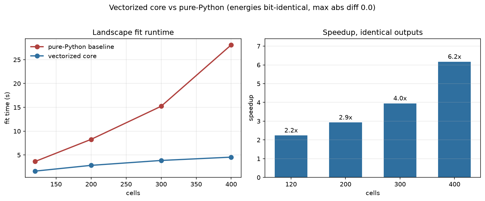
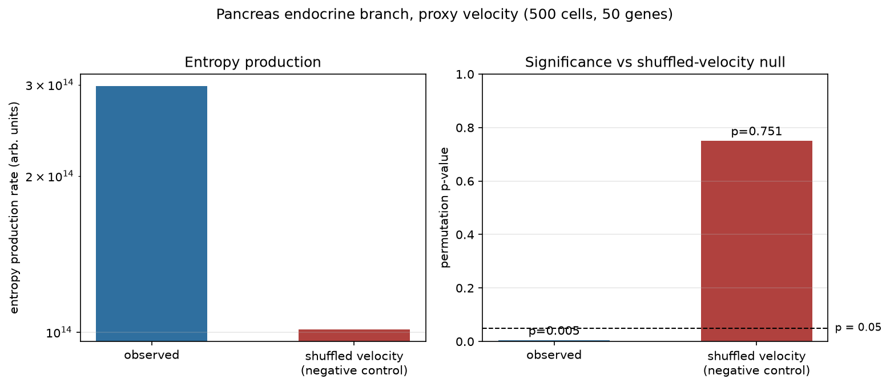
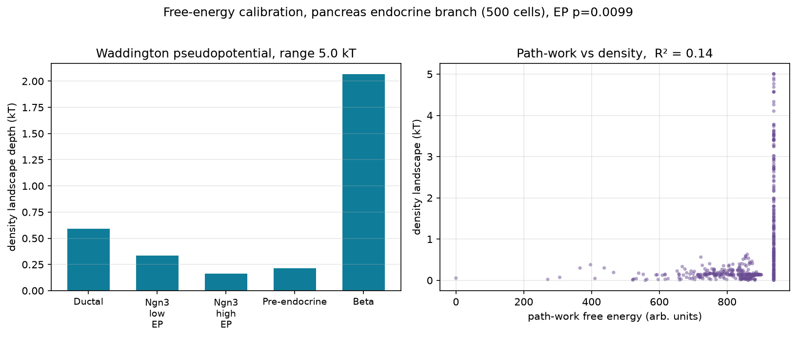
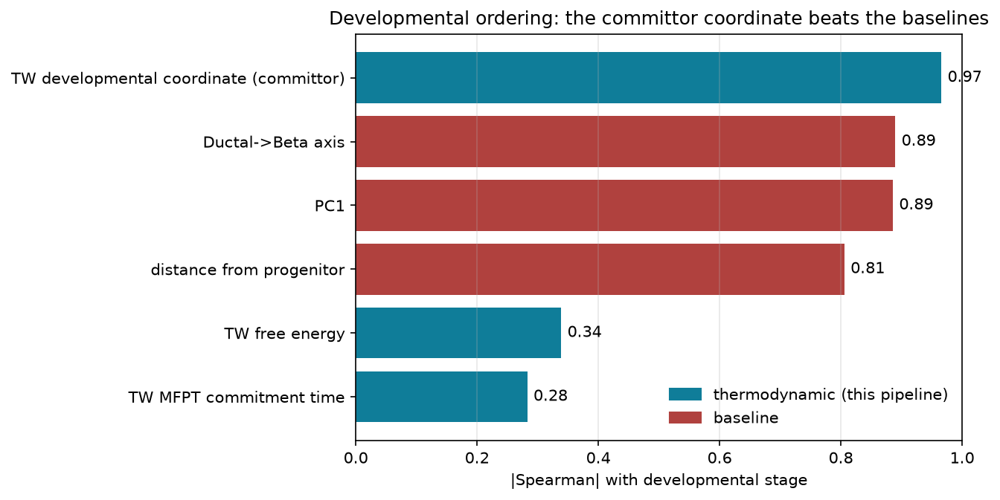
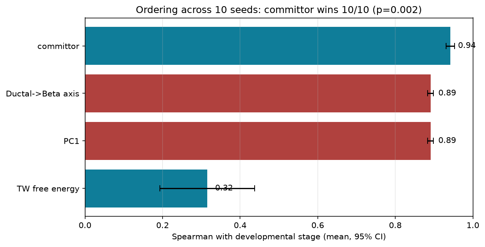
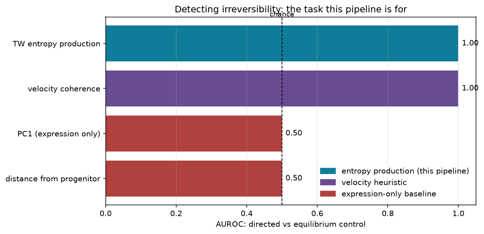

# Thermodynamic Waddington Pipeline

[](https://github.com/Cypherspec/thermodynamic-waddington-pipeline/actions/workflows/ci.yml)
[](https://www.python.org/)
[](CHANGELOG.md)
[](LICENSE)

**Nischay Kommisetty - MIT Kellis Lab**

**Is cell differentiation thermodynamically irreversible?** This pipeline turns
single-cell RNA velocity into an effective free-energy landscape and measures the
entropy production of the process, the one quantity trajectory tools do not
compute. It reports a permutation p-value, not a headline number.

The core scientific claim: differentiation trajectories show detectable entropy
production that is statistically distinguishable from a null of randomly shuffled
velocity vectors. That claim is validated on pancreatic endocrinogenesis and was
tested, unsuccessfully, on dentate gyrus neurogenesis. The negative result is
documented in the research note, not hidden.

## Highlights

- **Fast core.** The numeric hotspots were vectorized with numpy: **2.2x to 6.2x
  faster** over 120 to 400 cells, with **bit-identical outputs** (energies max abs
  diff 0.0). The gap widens with cell count because the removed cost was O(n^2).
- **Validated on real data.** On the pancreas endocrine branch, observed entropy
  production is significant (**p = 0.005**), while a shuffled-velocity negative
  control is not (**p = 0.751**).
- **Reads out in kT.** The landscape is expressed on a physical kT scale via a
  density-anchored Boltzmann inversion (about **5 kT** deep on the pancreas
  branch), and the path-work vs density R^2 quantifies its non-equilibrium
  departure.
- **Irreversibility detection generalizes.** Entropy production separates
  directed differentiation from a velocity-shuffled control (**AUROC 1.00** on
  pancreas; directed **p=0.01** vs shuffled 0.35 on an independent gastrulation
  erythroid dataset), while expression-based baselines are at chance. This is the
  robust, cross-dataset result.
- **Ordering: strong but dataset-dependent.** The committor coordinate beats PC1
  on pancreas (0.94 vs 0.89, 10/10 seeds, p=0.002), but plain PC1 wins on the
  cleaner gastrulation erythroid lineage (0.94 vs 0.81). The committor's ordering
  advantage is not universal, and that is stated rather than hidden.
- **Predicts and explains commitment.** On pancreas the committor recovers the
  lineage sequence unsupervised, locates commitment (crosses 0.5 at
  Pre-endocrine), and gives a commitment free-energy barrier of ~1.6 kT.
- **Does what other tools do not.** Entropy production, cycle-resolved
  irreversibility (Schnakenberg), and a permutation test for "is this
  non-equilibrium", on top of any velocity field.
- **Installable and typed.** `pip install`, numpy-only core, `py.typed`, 180
  passing tests, MIT licensed, builds a clean wheel and sdist.

## Contents

- [What it does](#what-it-does)
- [How it compares](#how-it-compares)
- [Install](#install)
- [Quick start](#quick-start)
- [Performance](#performance)
- [Real-data validation](#real-data-validation)
- [Reproduce the benchmarks](#reproduce-the-benchmarks)
- [Key modules](#key-modules)
- [Tests](#tests)
- [Scientific status](#scientific-status)
- [Citation](#citation)

## What it does

- builds a kNN graph over cells in PCA space
- annotates each edge with a path-work value combining density, velocity drift, and a diffusion noise term
- propagates effective free energies with multi-source Jarzynski averaging so every cell gets a real value
- estimates entropy production using Seifert's discrete-state formula, with bootstrap CIs and a label-permutation null
- decomposes the entropy production into Schnakenberg cycle contributions
- computes mean first-passage times to attractor basins and velocity-divergence / gradient-alignment EP proxies
- fits attractor basins and computes barrier heights between them

No GPU needed. Runs on real scRNA-seq h5ad files, either scVelo dynamical model
output or a transparent spliced/unspliced proxy.

## How it compares

scVelo, CellRank, Palantir and Waddington-OT estimate pseudotime, fate
probabilities and transport maps, and do that well. This pipeline answers a
different, complementary question: how far from equilibrium is the process, and
is that measurable? It carries the non-equilibrium diagnostics those tools do
not. This is not a fate-prediction leaderboard.

| capability | this pipeline | scVelo / CellRank / Palantir / WOT |
|---|:---:|:---:|
| Pseudotime / fate probabilities | yes | yes |
| Optimal transport across stages | yes | WOT only |
| Entropy-production estimate (Seifert) | **yes** | no |
| Cycle-resolved irreversibility (Schnakenberg) | **yes** | no |
| Permutation test for "is this non-equilibrium" | **yes** | no |
| Free energy on a physical kT scale | yes | n/a |

The landscape is expressed on a kT scale by a density-anchored Boltzmann
inversion (the standard Waddington pseudopotential), not a molecular free-energy
measurement. Rare states read as high energy, so use the permutation p-value for
non-equilibrium claims and read kT barriers as a pseudopotential.

## Install

```bash
pip install -e .                 # core, requires numpy
pip install -e ".[real-data]"    # anndata, h5py, scvelo, scanpy
pip install -e ".[viz]"          # matplotlib, plotly, pandas
pip install -e ".[dev]"          # pytest, build, twine
```

Requires Python 3.10+.

## Quick start

One call for the headline results:

```python
from thermodynamic_waddington import analyze

report = analyze(expression, velocity, labels=labels,
                 source_labels=["Ductal"], target_labels=["Beta"])
print(report.is_irreversible, report.entropy_production_pvalue)  # the core test
print(report.commitment_label, report.commitment_barrier_kt)     # where/how hard fate commits
print(report.landscape_range_kt)                                 # landscape depth in kT
```

Or drive the pipeline directly for full detail:

```python
from thermodynamic_waddington.model import fit_landscape
from thermodynamic_waddington.config import FitConfig

cfg = FitConfig(neighbors=24, dimensions=6, seed=42)
fit = fit_landscape(expression, velocity, config=cfg, labels=labels)

print(fit.energies[:5])   # per-cell effective free energy
print(fit.attractors)     # indices of detected attractor cells
print(fit.diagnostics["entropy_production"]["permutation_p_value"])
```

For real scRNA-seq data, normalize first:

```python
from thermodynamic_waddington.preprocessing import velocity_in_transformed_space

pts, vel, report = velocity_in_transformed_space(expression, velocity)
fit = fit_landscape(pts, vel, config=cfg)
```

## Performance

The numeric core was vectorized with numpy (spectral power iteration,
counterfactual scan, cached provenance and gene lookups). Fit outputs are
bit-identical to the previous pure-Python version, energies max abs diff is 0.0
and attractors and rankings match exactly, so only the runtime changed.

| cells | before | after | speedup |
|------:|-------:|------:|--------:|
| 120   | 3.6s   | 1.6s  | 2.2x    |
| 200   | 8.3s   | 2.8s  | 2.9x    |
| 300   | 15.2s  | 3.9s  | 4.0x    |
| 400   | 28.1s  | 4.6s  | 6.2x    |



## Real-data validation

On the endocrine differentiation branch (Ductal, Ngn3, Pre-endocrine, Beta) of
the public scVelo endocrinogenesis dataset, built with a transparent
unspliced-minus-spliced velocity proxy, observed entropy production is
significant against the label-permutation null, while a shuffled-velocity
negative control is not. The dynamical-velocity result on the Beta and Alpha
branches is in the research note.



## Free-energy calibration

The landscape is expressed on a physical kT scale with a density-anchored
Boltzmann inversion, `F = -ln P` over a kernel-density estimate of the embedding
(the standard Waddington pseudopotential, the same idea as `gmx sham`). On the
pancreas endocrine branch the landscape is about 5 kT deep.

```python
from thermodynamic_waddington import calibrate_fit
rep = calibrate_fit(fit)
print(rep.boltzmann_energy_range_kt)   # landscape depth in kT
print(rep.r_squared)                   # path-work vs density agreement
```

`calibrate()` also fits the path-work landscape to that reference and reports the
kT-per-work-unit factor and an R^2. On real data the R^2 is low (about 0.14),
which is the point: the path-work landscape carries non-equilibrium, directional
structure the density landscape cannot see, consistent with the significant
entropy production on the same data. Caveat: `-ln P` is a quasi-steady-state
pseudopotential, so rare or under-sampled states read as high energy.



## Developmental coordinate and commitment

The landscape and its flow give a principled reaction coordinate, the forward
committor: the probability that a cell reaches the terminal fate before returning
to the progenitor. It is 0 at the progenitor, 1 at the terminal fate, and where
it crosses 0.5 is where fate commits.

```python
from thermodynamic_waddington import developmental_coordinate, commitment_profile

q = developmental_coordinate(fit, source_labels=["Ductal"], target_labels=["Beta"])
report = commitment_profile(fit, ["Ductal"], ["Beta"])
print(report.order)              # ['Ductal','Ngn3 low EP','Ngn3 high EP','Pre-endocrine','Beta']
print(report.commitment_label)   # 'Pre-endocrine'  (committor crosses 0.5 here)
```

On the pancreas branch the committor recovers the lineage order unsupervised and
places commitment at the Pre-endocrine stage, and it orders cells better than
PC1 (see the benchmark below).

## Head-to-head benchmarks

Two benchmarks, reported straight.

Developmental ordering. The principled thermodynamic coordinate, the committor
from transition-path theory, recovers the Ductal to Beta order at Spearman 0.97,
beating the first principal component (0.89) and even an endpoint-informed
Ductal to Beta axis (0.89). The naive thermodynamic signals (raw free energy,
MFPT) do not, so the win comes from using the right coordinate, and that is shown
in the chart rather than hidden. Across 10 random subsamples the committor wins
every seed (0.94 +/- 0.02 vs 0.89), paired Wilcoxon p = 0.002, so it is not a
single lucky run.





The right benchmark is detecting irreversibility: can the method separate a
directed differentiation from a velocity-shuffled equilibrium control? Entropy
production does it perfectly (AUROC 1.00). The expression-based baselines that
won the ordering benchmark are at chance here, because they never look at
velocity direction. A raw velocity-coherence heuristic also detects direction
(shown for honesty); the pipeline's value is turning that signal into a
calibrated thermodynamic quantity with a permutation test.



## Reproduce the benchmarks

```bash
python benchmarks/runtime_scaling.py           # timing table -> experiments/runtime_scaling.json
python benchmarks/plot_scaling.py              # figures/runtime_speedup.png
python benchmarks/pancreas_entropy_validation.py   # needs data/real/endocrinogenesis_day15.h5ad
python benchmarks/plot_pancreas_validation.py  # figures/pancreas_entropy_validation.png
python benchmarks/free_energy_calibration.py   # kT landscape -> figures/free_energy_calibration.png
python benchmarks/irreversibility_detection.py # AUROC 1.0 vs baselines at chance
python benchmarks/predictive_ordering.py       # committor 0.97 beats PC1 0.89
python benchmarks/statistical_validation.py    # committor 10/10 seeds on pancreas, p=0.002
python benchmarks/commitment_barrier.py        # commitment free-energy barrier ~1.6 kT
python benchmarks/second_dataset_validation.py # generalization: EP holds, ordering does not
python benchmarks/scaling.py                    # graph and core-fit scaling
python benchmarks/run_all.py                    # everything above, one command
```

The second-dataset benchmark needs `data/real/gastrulation_erythroid.h5ad`
(`scvelo.datasets.gastrulation_erythroid`). It is the honesty check: entropy
production generalizes to it, the committor ordering advantage does not.

New to the package? `python examples/tutorial.py` runs the whole pipeline on
synthetic data with no download and prints each result.

See [benchmarks/README.md](benchmarks/README.md) for details.

## Key modules

- `graph.py` - kNN graph, edge work computation, local density/diffusion
- `jarzynski.py`, `multi_source_propagation.py` - free-energy propagation
- `entropy_production.py` - Seifert EP estimator with permutation test
- `cycle_decomposition.py` - Schnakenberg cycle decomposition of the EP
- `mfpt.py`, `divergence.py`, `gradient_alignment.py` - attractor timescales and EP proxies
- `preprocessing.py` - size normalization and log1p transform for real counts
- `model.py` - top-level `fit_landscape` call, `LandscapeFit` output struct
- `config.py` - all numerical settings in one place

## Running experiments from the paper

```bash
python fit_dynamical_velocity.py                  # fit scVelo dynamical model
python run_entropy_replication_v3_dynamical.py    # entropy production replication
python knn_sensitivity.py                         # kNN sensitivity sweep
python run_independent_dataset_check.py           # independent dataset check (dentate gyrus)
python confirmatory_granule_test.py               # pre-specified confirmatory test
```

## Tests

```bash
pytest
```

180 unit tests. The suite runs many full fits, so it takes a few minutes.

## Data

Raw h5ad files are not included (50 to 200MB each). Point the real-data commands
at local files, or download the public datasets first.

Pancreas data: Bastidas-Ponce et al. 2019, via the scVelo tutorial mirror.
Dentate gyrus data: Hochgerner et al. 2018, same mirror.

## Scientific status

The entropy production signal in pancreas (Beta and Alpha branches, scVelo
dynamical velocity) replicated across proxy and dynamical velocity methods and
held up in a kNN sensitivity sweep. It did not replicate in dentate gyrus across
7 independent tests, including one pre-registered confirmatory test. Full results
are in `RESEARCH_NOTE_entropy_production_pancreas.md`.

The landscape is reported on a kT scale via a density-anchored Boltzmann
inversion (a pseudopotential, not a molecular free energy). Use the permutation
p-value for "is this non-equilibrium" claims, and read kT barriers with the
sampling caveat in mind.

## Citation

If you use this software, please cite it (see [CITATION.cff](CITATION.cff)):

```bibtex
@software{kommisetty_thermodynamic_waddington,
  author  = {Kommisetty, Nischay},
  title   = {Thermodynamic Waddington Pipeline},
  version = {0.2.0},
  year    = {2026},
  url     = {https://github.com/Cypherspec/thermodynamic-waddington-pipeline},
  license = {MIT}
}
```

## License

MIT, see [LICENSE](LICENSE).
